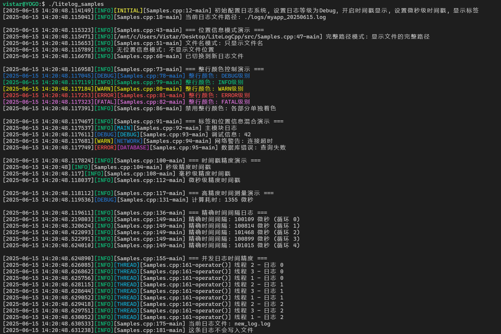

# LiteLogCpp


[](https://en.cppreference.com/w/cpp/11)  [](https://github.com/vistar-terry/magic_enum/blob/main/LICENSE)  [](#)  [](https://github.com/vistar-terry/LiteLogCpp/blob/main/README.md)  [](https://github.com/vistar-terry/LiteLogCpp/blob/main/README_EN.md) 


LiteLogCpp 是一个轻量级的 C++ 日志库，专为现代 C++ 应用程序设计。它提供了丰富的日志功能，包括多级日志、标签系统、彩色输出等，同时保持了简洁易用的接口。

仓库链接: [https://github.com/vistar-terry/LiteLogCpp](https://github.com/vistar-terry/LiteLogCpp)

issues: [https://github.com/vistar-terry/LiteLogCpp/issues](https://github.com/vistar-terry/LiteLogCpp/issues)

如果对你有帮助，欢迎Star，有任何问题可以在issues页面交流。


## 特性

- **轻量级设计**：单头文件实现，易于集成
- **支持设置不同日志等级**
- **标签系统**：支持为日志添加分类标签，支持按标签过滤和配置
- **彩色输出**：支持 ANSI 彩色日志输出（模式可选）
- **文件输出**：支持日志文件输出
- **位置信息**：可配置代码位置显示（文件名、行号、函数名）（模式可选）
- **高精度时间戳**：支持秒、毫秒、微秒级时间戳（模式可选）


## 快速开始

```bash
git clone https://github.com/vistar-terry/LiteLogCpp.git
cd LiteLogCpp
mkdir build
cd build
cmake ..
make
./litelog_samples
```




## 集成到项目

在需要记录日志的文件中包含 src 下的 LiteLog.hpp 文件：

```cpp
#include "LiteLog.hpp"
```


## 基本用法

```cpp
// 记录无标签日志
LOG_INFO("Application started");
LOG_DEBUG("Loading configuration...");
LOG_WARN("Low memory warning");
LOG_ERROR("Failed to open file: %s", filename);

// 记录带标签日志
LOG_INFO_T("NETWORK", "Connected to %s:%d", host, port);
LOG_DEBUG_T("DATABASE", "Executing query: %s", query);
```


## 配置日志系统

```cpp
// 设置全局日志级别
Logger::instance().setLevel(LogLevel::Debug);

// 添加控制台输出（默认已启用）
Logger::instance().consoleOutput(true);

// 设置日志文件
Logger::instance().setLogDirectory("/var/log/myapp", "myapp");

// 配置标签显示
Logger::instance().configureTag("NETWORK", ansi::blue);
Logger::instance().configureTag("DATABASE", ansi::magenta);

// 设置时间戳精度为微秒
Logger::instance().setTimestampPrecision(TimestampPrecision::MICROSECONDS);
```


## 接口说明

### 日志宏

#### 无标签日志宏

| 宏定义                | 日志级别 | 示例                                        |
| :-------------------- | :------- | :------------------------------------------ |
| `LOG_TRACE(fmt, ...)` | Trace    | `LOG_TRACE("Entering function")`            |
| `LOG_DEBUG(fmt, ...)` | Debug    | `LOG_DEBUG("Value: %d", value)`             |
| `LOG_INFO(fmt, ...)`  | Info     | `LOG_INFO("Application started")`           |
| `LOG_WARN(fmt, ...)`  | Warn     | `LOG_WARN("Resource low")`                  |
| `LOG_ERROR(fmt, ...)` | Error    | `LOG_ERROR("File not found: %s", filename)` |
| `LOG_FATAL(fmt, ...)` | Fatal    | `LOG_FATAL("Critical error, exiting")`      |

#### 带标签日志宏

| 宏定义                       | 日志级别 | 示例                                         |
| :--------------------------- | :------- | :------------------------------------------- |
| `LOG_TRACE_T(tag, fmt, ...)` | Trace    | `LOG_TRACE_T("NETWORK", "Packet received")`  |
| `LOG_DEBUG_T(tag, fmt, ...)` | Debug    | `LOG_DEBUG_T("DB", "Query: %s", sql)`        |
| `LOG_INFO_T(tag, fmt, ...)`  | Info     | `LOG_INFO_T("AUTH", "User logged in")`       |
| `LOG_WARN_T(tag, fmt, ...)`  | Warn     | `LOG_WARN_T("PERF", "Slow response")`        |
| `LOG_ERROR_T(tag, fmt, ...)` | Error    | `LOG_ERROR_T("IO", "Write failed")`          |
| `LOG_FATAL_T(tag, fmt, ...)` | Fatal    | `LOG_FATAL_T("CORE", "Unrecoverable error")` |


### 配置方法

#### 日志等级配置

```cpp
// 设置全局日志等级
void setLevel(LogLevel level);

// 设置标签日志等级
void setTagLevel(const std::string &tag, LogLevel level);
```

**参数说明**：

- `level`: 日志级别枚举值
    - `LogLevel::Trace`: 最详细的调试信息
    - `LogLevel::Debug`: 调试信息
    - `LogLevel::Info`: 常规信息 (默认)
    - `LogLevel::Warn`: 警告信息
    - `LogLevel::Error`: 错误信息
    - `LogLevel::Fatal`: 严重错误
    - `LogLevel::OFF`: 关闭所有日志
- `tag`: 标签名称字符串

#### 输出目标控制

```cpp
// 开启/禁用控制台输出
void consoleOutput(const bool& console_output);

// 设置日志文件路径
bool setLogFile(const std::string &file_path, bool append = true);

// 设置日志目录与日志文件前缀
bool setLogDirectory(const std::string &dir_path,
                    const std::string &file_prefix = "app",
                    bool append = true,
                    bool daily_rotation = false);

// 关闭日志文件
void closeLogFile();

// 获取当前日志文件路径
std::string getLogFilePath() const;
```

**参数说明**：

- `console_output`: 是否开启控制台输出
- `file_path`: 日志文件完整路径
- `dir_path`: 日志目录路径
- `file_prefix`: 日志文件名前缀（默认为app）
- `append`: 是否追加到现有文件 (默认为 true)
- `daily_rotation`: 是否按日期轮转文件 (默认为 false)

#### 标签配置

```cpp
// 配置标签显示
void configureTag(const std::string &tag, const char *color, 
                 const char *style = "", bool enabled = true);

// 启用/禁用特定标签
void enableTag(const std::string &tag, bool enabled);

// 启用/禁用标签显示
void enableTags(bool enabled);
```

**参数说明**：

- `tag`: 标签名称字符串
- `color`: ANSI 颜色代码 (如 ansi::blue)
- `style`: ANSI 样式代码 (如 ansi::bold)
- `enabled`: 是否启用标签

#### 显示格式配置

```cpp
// 设置颜色模式
void setColorMode(ColorMode color_mode);

// 启用/禁用时间戳
void enableTimestamp(bool enabled);

// 设置时间戳精度
void setTimestampPrecision(TimestampPrecision precision);

// 设置位置信息显示模式
void setLocationMode(LocationDisplayMode mode, 
                    const std::string &base_path = "");
```

**参数说明**：

- `color_mode`: 颜色模式枚举值
    - `ColorMode::OFF`: 关闭所有颜色
    - `ColorMode::TAG`: 标签和等级彩色输出
    - `ColorMode::LINE`: 整行彩色输出 (默认)
- `precision`: 时间戳精度枚举值
    - `TimestampPrecision::SECONDS`: 秒级精度
    - `TimestampPrecision::MILLISECONDS`: 毫秒级精度 (默认)
    - `TimestampPrecision::MICROSECONDS`: 微秒级精度
- `mode`: 位置信息显示模式枚举值
    - `LocationDisplayMode::FULL_PATH`: 显示完整路径
    - `LocationDisplayMode::FILENAME_ONLY`: 只显示文件名 (默认)
    - `LocationDisplayMode::RELATIVE_PATH`: 显示相对路径
    - `LocationDisplayMode::NONE`: 不显示位置信息
- `base_path`: 相对路径的基准路径


### 枚举类型

#### 日志级别 (LogLevel)

- `Trace`：最详细的调试信息
- `Debug`：调试信息
- `Info`：常规信息 (默认)
- `Warn`：警告信息
- `Error`：错误信息
- `Fatal`：严重错误
- `OFF`：关闭所有日志

#### 时间戳精度 (TimestampPrecision)

- `SECONDS`：秒级精度
- `MILLISECONDS`：毫秒级精度 (默认)
- `MICROSECONDS`：微秒级精度

#### 位置信息显示模式 (LocationDisplayMode)

- `FULL_PATH`：显示完整路径
- `FILENAME_ONLY`：只显示文件名 (默认)
- `RELATIVE_PATH`：显示相对路径
- `NONE`：不显示位置信息

#### 彩色输出模式 (ColorMode)

- `OFF`：关闭
- `TAG`：仅标签和等级彩色输出 (默认)
- `LINE`：整行彩色输出


## 配置选项

### 预设标签颜色

LiteLogCpp 预配置了常用标签的颜色：

- `NETWORK`：蓝色
- `DATABASE`：洋红色
- `UI`：绿色
- `SYSTEM`：黄色
- `SECURITY`：红色

您可以自定义或添加新标签：

```cpp
Logger::instance().configureTag("AUDIT", ansi::cyan);
Logger::instance().configureTag("PERFORMANCE", ansi::yellow, ansi::bold);
```


### ANSI 颜色常量

LiteLogCpp 提供了以下 ANSI 颜色常量：

```cpp
namespace ansi {
    // 重置和样式
    constexpr const char *reset = "\033[0m";
    constexpr const char *bold = "\033[1m";
    
    // 前景色
    constexpr const char *black = "\033[30m";
    constexpr const char *red = "\033[31m";
    constexpr const char *green = "\033[32m";
    constexpr const char *yellow = "\033[33m";
    constexpr const char *blue = "\033[34m";
    constexpr const char *magenta = "\033[35m";
    constexpr const char *cyan = "\033[36m";
    constexpr const char *white = "\033[37m";
    
    // 背景色
    constexpr const char *bg_red = "\033[41m";
    constexpr const char *bg_green = "\033[42m";
    constexpr const char *bg_yellow = "\033[43m";
    constexpr const char *bg_blue = "\033[44m";
    constexpr const char *bg_magenta = "\033[45m";
    constexpr const char *bg_cyan = "\033[46m";
    constexpr const char *bg_white = "\033[47m";
}
```


## 未来计划

- 添加异步日志支持
- 添加日志过滤功能
- 支持 JSON 格式输出
- 添加日志文件压缩功能
