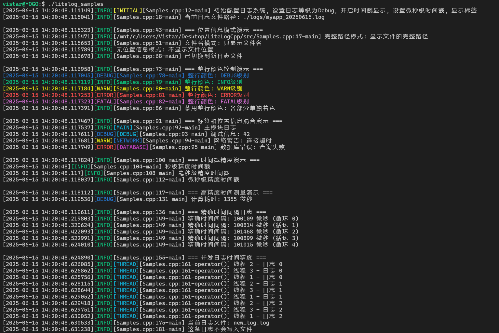

# LiteLogCpp


[](https://en.cppreference.com/w/cpp/11)  [](https://github.com/vistar-terry/magic_enum/blob/main/LICENSE)  [](#)  [](https://github.com/vistar-terry/LiteLogCpp/blob/main/README.md)  [](https://github.com/vistar-terry/LiteLogCpp/blob/main/README_EN.md) 


LiteLogCpp is a lightweight C++log library designed specifically for modern C++applications. It provides rich logging functions, including multi-level logging, tagging system, color output, etc., while maintaining a simple and easy-to-use interface.

repository url: [https://github.com/vistar-terry/LiteLogCpp](https://github.com/vistar-terry/LiteLogCpp)

issues: [https://github.com/vistar-terry/LiteLogCpp/issues](https://github.com/vistar-terry/LiteLogCpp/issues)

If this project helps you, please consider giving it a star! 

You can also communicate any issues on the issues page.


## Features

- **Lightweight minimalist design**: Single-header implementation, easy to integrate
- **Multi-level logging**: Supports setting different log levels
- **Tag system**: Supports adding category tags to logs, enabling tag-based filtering and configuration
- **Color output**: Supports ANSI color logging (optional mode)
- **File output**: Supports logging to files
- **Source location**: Configurable display of code location (file name, line number, function name) (optional mode)
- **High-precision timestamps**: Supports second, millisecond, and microsecond precision (optional mode)


## Fast Start

```bash
git clone https://github.com/vistar-terry/LiteLogCpp.git
cd LiteLogCpp
mkdir build
cd build
cmake ..
make
./litelog_samples
```




## Add to your project

In the file where logging is required, include the `LiteLog.hpp` file located under the `src` directory of this repository:

```cpp
#include "LiteLog.hpp"
```


## Basic Usage

```cpp
// Record unlabeled logs
LOG_INFO("Application started");
LOG_DEBUG("Loading configuration...");
LOG_WARN("Low memory warning");
LOG_ERROR("Failed to open file: %s", filename);

// Record labeled logs
LOG_INFO_T("NETWORK", "Connected to %s:%d", host, port);
LOG_DEBUG_T("DATABASE", "Executing query: %s", query);
```


## Configure the logging system

```cpp
// Set global log level
Logger::instance().setLevel(LogLevel::Debug);

// Add console output (enabled by default)
Logger::instance().consoleOutput(true);

// Set log file
Logger::instance().setLogDirectory("/var/log/myapp", "myapp");

// Configure tag display
Logger::instance().configureTag("NETWORK", ansi::blue);
Logger::instance().configureTag("DATABASE", ansi::magenta);

// Set timestamp precision to microseconds
Logger::instance().setTimestampPrecision(TimestampPrecision::MICROSECONDS);
```


## Interface Description

### Log Macros

#### Unlabeled Log Macros

| Macro Define          | Log Level | Example                                     |
| :-------------------- | :-------- | :------------------------------------------ |
| `LOG_TRACE(fmt, ...)` | Trace     | `LOG_TRACE("Entering function")`            |
| `LOG_DEBUG(fmt, ...)` | Debug     | `LOG_DEBUG("Value: %d", value)`             |
| `LOG_INFO(fmt, ...)`  | Info      | `LOG_INFO("Application started")`           |
| `LOG_WARN(fmt, ...)`  | Warn      | `LOG_WARN("Resource low")`                  |
| `LOG_ERROR(fmt, ...)` | Error     | `LOG_ERROR("File not found: %s", filename)` |
| `LOG_FATAL(fmt, ...)` | Fatal     | `LOG_FATAL("Critical error, exiting")`      |

#### Labeled Log Macros

| Macro Define                 | Log Level | Example                                      |
| :--------------------------- | :-------- | :------------------------------------------- |
| `LOG_TRACE_T(tag, fmt, ...)` | Trace     | `LOG_TRACE_T("NETWORK", "Packet received")`  |
| `LOG_DEBUG_T(tag, fmt, ...)` | Debug     | `LOG_DEBUG_T("DB", "Query: %s", sql)`        |
| `LOG_INFO_T(tag, fmt, ...)`  | Info      | `LOG_INFO_T("AUTH", "User logged in")`       |
| `LOG_WARN_T(tag, fmt, ...)`  | Warn      | `LOG_WARN_T("PERF", "Slow response")`        |
| `LOG_ERROR_T(tag, fmt, ...)` | Error     | `LOG_ERROR_T("IO", "Write failed")`          |
| `LOG_FATAL_T(tag, fmt, ...)` | Fatal     | `LOG_FATAL_T("CORE", "Unrecoverable error")` |


### Configuration Methods

#### Log Level Configuration

```cpp
// Set log level
void setLevel(LogLevel level);

// Set tag log level
void setTagLevel(const std::string &tag, LogLevel level);
```

- **Parameter Description**:
    - `level`: Log level enumeration value
    - `LogLevel::Trace`: Most detailed debug information
    - `LogLevel::Debug`: Debug information
    - `LogLevel::Info`: General information (**default**)
    - `LogLevel::Warn`: Warning information
    - `LogLevel::Error`: Error information
    - `LogLevel::Fatal`: Critical error
    - `LogLevel::OFF`: Disable all logs
    - `tag`: Tag name string

#### Output Target Control

```cpp
// Enable/Disable Console Output
void consoleOutput(const bool& console_output);

// Set Log File Path
bool setLogFile(const std::string &file_path, bool append = true);

// Set Log Directory and Log File Prefix
bool setLogDirectory(const std::string &dir_path,
                    const std::string &file_prefix = "app",
                    bool append = true,
                    bool daily_rotation = false);

// Close Log File
void closeLogFile();

// Get Current Log File Path
std::string getLogFilePath() const;
```

**Parameter Description**:

- `console_output`: Whether to enable console output
- `file_path`: Full path to the log file
- `dir_path`: Path to the log directory
- `file_prefix`: Log file name prefix (default is "app")
- `append`: Whether to append to the existing file (default is `true`)
- `daily_rotation`: Whether to rotate files by date (default is `false`)

#### Tag Configuration

```cpp
// Configure tag display
void configureTag(const std::string &tag, const char *color, 
                 const char *style = "", bool enabled = true);

// Enable/Disable Specific Tags
void enableTag(const std::string &tag, bool enabled);

// Enable/Disable Tag Display
void enableTags(bool enabled);
```

**Parameter Description**:

- `tag`: Tag name string
- `color`: ANSI color code (e.g., `ansi::blue`)
- `style`: ANSI style code (e.g., `ansi::bold`)
- `enabled`: Whether to enable the tag

#### Display Format Configuration

```cpp
// Set color mode
void setColorMode(ColorMode color_mode);

// Enable/Disable Timestamp
void enableTimestamp(bool enabled);

// Set Timestamp Precision
void setTimestampPrecision(TimestampPrecision precision);

// Set Location Information Display Mode
void setLocationMode(LocationDisplayMode mode, 
                    const std::string &base_path = "");
```

**Parameter Description**:

- `color_mode`: Color mode enumeration
    - `ColorMode::OFF`: Turn off all color output
    - `ColorMode::TAG`: Colored output for tags and log levels
    - `ColorMode::LINE`: Colored output for the entire line (**default**)
- `precision`: Timestamp precision enumeration
    - `TimestampPrecision::SECONDS`: Second-level precision
    - `TimestampPrecision::MILLISECONDS`: Millisecond-level precision (**default**)
    - `TimestampPrecision::MICROSECONDS`: Microsecond-level precision
- `mode`: Source location display mode enumeration
    - `LocationDisplayMode::FULL_PATH`: Display full file path
    - `LocationDisplayMode::FILENAME_ONLY`: Display only the file name (**default**)
    - `LocationDisplayMode::RELATIVE_PATH`: Display relative path
    - `LocationDisplayMode::NONE`: Do not display location information
- `base_path`: Base path used when displaying relative paths


### Enum Types

#### Log Level (`LogLevel`)

- `Trace`: Most detailed debug information
- `Debug`: Debug information
- `Info`: General information (**default**)
- `Warn`: Warning information
- `Error`: Error information
- `Fatal`: Critical error
- `OFF`: Disable all logs

#### Timestamp Precision (`TimestampPrecision`)

- `SECONDS`: Second-level precision
- `MILLISECONDS`: Millisecond-level precision (**default**)
- `MICROSECONDS`: Microsecond-level precision

#### Source Location Display Mode (`LocationDisplayMode`)

- `FULL_PATH`: Display full file path
- `FILENAME_ONLY`: Display only the file name (**default**)
- `RELATIVE_PATH`: Display relative path
- `NONE`: Do not display location information

#### Color Output Mode (`ColorMode`)

- `OFF`: Color output disabled
- `TAG`: Colored output for tags and log levels (**default**)
- `LINE`: Colored output for the entire line


## Configuration Items

#### Predefined Tag Colors

LiteLogCpp comes with predefined colors for commonly used tags:

- `NETWORK`: Blue
- `DATABASE`: Magenta
- `UI`: Green
- `SYSTEM`: Yellow
- `SECURITY`: Red

You can customize or add new tags:

```cpp
Logger::instance().configureTag("AUDIT", ansi::cyan);
Logger::instance().configureTag("PERFORMANCE", ansi::yellow, ansi::bold);
```


#### ANSI color constants

The following ANSI color constants are provided:

```cpp
namespace ansi {
    // 重置和样式
    constexpr const char *reset = "\033[0m";
    constexpr const char *bold = "\033[1m";
    
    // 前景色
    constexpr const char *black = "\033[30m";
    constexpr const char *red = "\033[31m";
    constexpr const char *green = "\033[32m";
    constexpr const char *yellow = "\033[33m";
    constexpr const char *blue = "\033[34m";
    constexpr const char *magenta = "\033[35m";
    constexpr const char *cyan = "\033[36m";
    constexpr const char *white = "\033[37m";
    
    // 背景色
    constexpr const char *bg_red = "\033[41m";
    constexpr const char *bg_green = "\033[42m";
    constexpr const char *bg_yellow = "\033[43m";
    constexpr const char *bg_blue = "\033[44m";
    constexpr const char *bg_magenta = "\033[45m";
    constexpr const char *bg_cyan = "\033[46m";
    constexpr const char *bg_white = "\033[47m";
}
```


## Future Plans（Maybe）

- Add support for asynchronous logging
- Add log filtering functionality
- Support JSON format output
- Add log file compression feature

